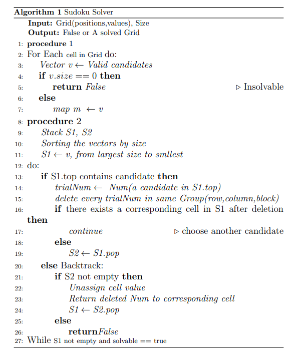
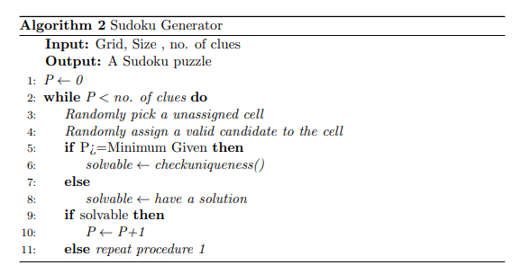
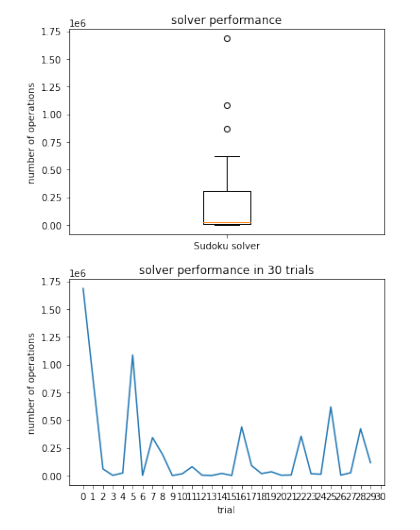
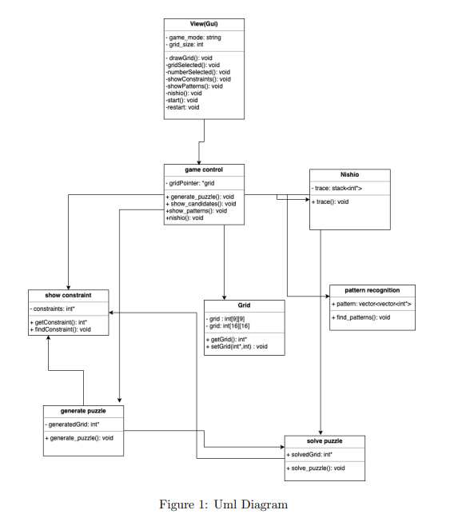
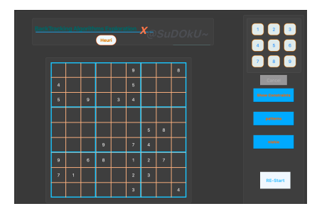
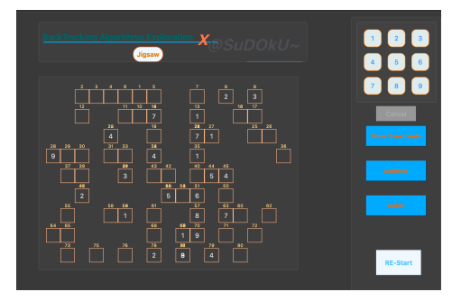

# Soduku X Backtracking Algorithms
Demo: https://youtu.be/FXiraJbiL8Y
### Introduction
> This project is aiming at: 
> * develope an efficient backtracking algorithm for solving Soduku - one of the NP-Complete problems https://en.wikipedia.org/wiki/NP-completeness
> * develope a software for studying NP-Complete problems through playing Soduku  
### Solver

### Generator

### Performance

### Software Design

### GUI snapshot
   

### How to run
  > -  install Qt :https://www.qt.io/
  > -  run on Qt Creator
   
   
  

